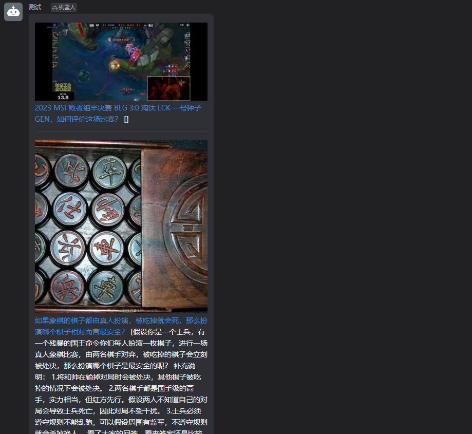

## 知乎热榜爬取

> 利用GitHub actions 自动爬取知乎每日热榜50条，目前已支持接入钉钉机器人，后续会抽时间接入飞书

## 快速开始（钉钉）

1. 在钉钉新建群聊
2. 添加机器人
3. 选择自定义机器人
4. 创建机器人详情，配置关键词为`1`,如图

5. 点击完成，复制Webhook地址到代码的 `com/mobaijun/constant/Constant.java` 的钉钉 `DING_WEBHOOK`
6. 运行测试（效果图）

通知详情

内容详情

## 默认知乎详情

## 开发计划

- 钉钉✔
- 飞书（计划中）
- 企业微信（计划中）
- 文档✔

## 疑难解答

请在GitHub issue 进行提问，或者前往[我的博客](https://www.mobaijun.com/contact/)进行留言