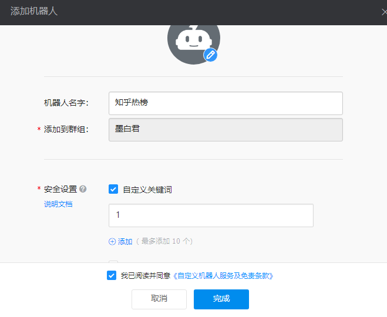

## 知乎热榜爬取

> 利用GitHub actions 自动爬取知乎每日热榜50条，目前已支持接入钉钉机器人，飞书机器人.(本地jdk版本最低11)

## 快速开始（钉钉）

1. 在钉钉新建群聊
2. 添加机器人
3. 选择自定义机器人
4. 创建机器人详情，配置关键词为`1`,如图

5. 点击完成，复制 Webhook 地址到 GitHub 工作流，新建：DING_WEBHOOK 系统环境变量
6. 运行测试（效果图）

通知详情

内容详情

## 默认知乎详情

## 快速开始（飞书）

1. 参考官方文档创建机器人（[创建机器人](https://open.feishu.cn/document/client-docs/bot-v3/add-custom-bot#399d949c)）
2. ==出于安全考虑配置了飞书机器人的签名校验，需要你在 `com.mobaijun.constant.Constant` 配置 `FS_WEBHOOK ` 地址和签名配置==,改为工作流配置，参数是：`FS_WEBHOOK`，`FS_SIGN`

~~~java
/**
 * 飞书地址
 */
public static final String FS_WEBHOOK = "https://open.feishu.cn/open-apis/bot/v2/hook/888888888888888888888888888";
/**
 * 飞书签名
 */
public static final String FS_SIGN = "888888888888888888888888888";
~~~

3. 修改 `com.mobaijun.util.DataAnalysisUtil` 下的 `private static void sendMsg(List<ZhInfo> infoList)` 方法，将飞书改为 `true` 即可执行测试：

~~~java
/**
 * 构件markdown推送信息
 *
 * @param infoList 消息列表
 */
private static void sendMsg(List<ZhInfo> infoList) {
    StringBuilder msg = new StringBuilder();
    // 钉钉最好不要超过15条热榜，否则无法发送，飞书不要超过10条数据，并且飞书不支持markdown，后续有空在优化飞书显示内容
    infoList.subList(0, 15).forEach(item -> msg.append(item.formatMarkdownMsg())
            .append(System.lineSeparator())
            .append(System.lineSeparator()).append("---")
            .append(System.lineSeparator()).append(System.lineSeparator()));
    // 需要推送的平台改为 true 即可，默认 false
    RobotClient.sendMessage(true, true, Constant.DING_WEBHOOK, Constant.FS_WEBHOOK, msg.toString());
}
~~~

4. 效果图如下

## 开发计划

- 钉钉✔
- 飞书✔
- 企业微信 X (不准备支持了，听说也不支持 markdown)
- 文档✔
- 邮箱（计划中）

## 疑难解答

请在GitHub issue 进行提问，或者前往[我的博客](https://www.mobaijun.com/contact/)进行留言
